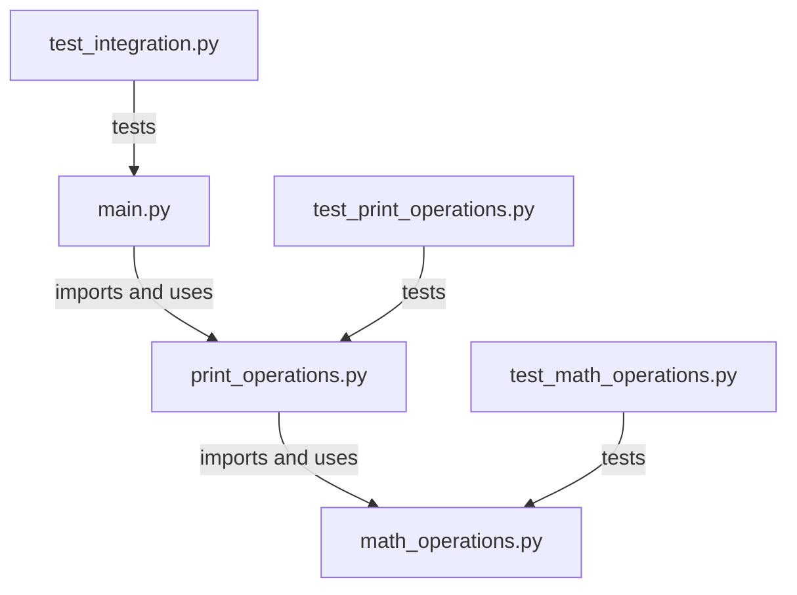

# Math Operations Project Code and Flowchart

## Mermaid Flowchart



## main.py
```python
# main.py

# Import the module that contains functions for printing operations
import print_operations as print_operations


# This function prompts the user for two numbers, ensuring they are valid floats.
def get_user_input():
    """
    Prompts the user to enter two numbers and returns them as a tuple.

    Returns:
        tuple of float: A tuple containing two float numbers entered by the user.
    """
    while True:
        try:
            a = float(input("Enter the first number: "))  # Convert input to float
            b = float(input("Enter the second number: "))  # Convert input to float
            return a, b
        except ValueError:
            print(
                "Invalid input. Please enter a number."
            )  # Error handling for invalid input


# The main function of the script, which performs operations using the user's input.
def main(a, b):
    """
    The main function of the script, performing print operations on given numbers.

    Args:
        a (float): The first number.
        b (float): The second number.
    """
    print_operations.print_operations(a, b)


if __name__ == "__main__":
    # Entry point of the script. Gets user input and calls the main function.
    # This last part of the script checks if this script is being run directly or being imported as a module.
    # If it's being run directly, it calls the main function. This is a common Python idiom to prevent
    # code from being run when the module is imported.
    a, b = get_user_input()
    main(a, b)
```

## math_operations.py
```python
# math_operations.py

# Type hints are used in the function definitions to indicate the expected types of the parameters and return value.
# For example, 'a: float' indicates that 'a' is expected to be a float. Similarly, '-> float' indicates that the function is expected to return a float.

# This module defines basic mathematical operations.


def add(a: float, b: float) -> float:
    """
    Adds two numbers.

    Args:
        a (float): The first number.
        b (float): The second number.

    Returns:
        float: The sum of a and b.
    """
    return a + b


# Additional functions for subtract, multiply, and divide follow a similar format.
# They take two floats as input and return a float as output.


def subtract(a: float, b: float) -> float:
    """
    Subtracts the second number from the first and returns the difference.

    Args:
        a (float): The number from which to subtract.
        b (float): The number to subtract.

    Returns:
        float: The difference between a and b.
    """
    return a - b


def multiply(a: float, b: float) -> float:
    """
    Multiplies two numbers and returns the product.

    Args:
        a (float): The first number to multiply.
        b (float): The second number to multiply.

    Returns:
        float: The product of a and b.
    """
    return a * b


def divide(a: float, b: float) -> float:
    """
    Divides the first number by the second and returns the quotient.

    Args:
        a (float): The dividend.
        b (float): The divisor.

    Returns:
        float: The quotient of a divided by b. If b is zero, returns 'float('inf')'.

    Raises:
        ZeroDivisionError: If the divisor (b) is zero.
    """
    if b != 0:
        return a / b
    else:
        raise ZeroDivisionError("Cannot divide by zero!")
```

## print_operations.py
```python
# print_operations.py

# This module is responsible for printing the results of basic arithmetic operations.
# It imports necessary functions from the 'math_operations' module.

from math_operations import add, subtract, multiply, divide

def print_operations(a: float, b: float) -> None:
    """
    Print the results of arithmetic operations on two numbers.

    This function takes two floating-point numbers and prints the results of adding, subtracting, 
    multiplying, and dividing them. For division, it handles the division by zero scenario.

    Parameters:
    a (float): The first number.
    b (float): The second number.
    """
    # Printing the sum of a and b
    print(f"The sum of {a} and {b} is {add(a, b)}")
    
    # Printing the difference between a and b
    print(f"The difference between {a} and {b} is {subtract(a, b)}")

    # Printing the product of a and b
    print(f"The product of {a} and {b} is {multiply(a, b)}")

    # Printing the division result of a by b. If b is zero, it prints an error message from the divide function.
    try:
        print(f"The division of {a} by {b} results in {divide(a, b)}")
    except ZeroDivisionError as e:
        print(e)

```

## test_integration.py
```python
from typing import Tuple

import pytest
from main import get_user_input, main
from math_operations import add, subtract, multiply, divide
from print_operations import print_operations
from unittest.mock import patch

# Test for user input handling
def test_get_user_input() -> None:
    with patch('builtins.input', side_effect=['5', '3']):
        assert get_user_input() == (5.0, 3.0)

    with patch('builtins.input', side_effect=['invalid', '5', '3']):
        assert get_user_input() == (5.0, 3.0)

# Integration tests for math_operations and print_operations modules
def test_add_and_print(capsys: pytest.CaptureFixture[str]) -> None:
    a, b = 5, 3
    print_operations(a, b)
    captured = capsys.readouterr()
    assert f"The sum of {a} and {b} is {add(a, b)}" in captured.out
```

## test_math_operations.py
```python
# test_math_operations.py

# This test module contains unit tests for the math_operations module.
# It tests basic arithmetic functions including addition, subtraction, multiplication, and division.

from typing import Any
import pytest
from math_operations import add, subtract, multiply, divide

# Test cases for add function
def test_add():
    """
    Test the add function from the math_operations module.
    
    Ensures that:
    - Positive numbers are added correctly.
    - Negative numbers are added correctly.
    - Adding opposite numbers yields zero.
    """
    assert add(1, 2) == 3
    assert add(-1, -2) == -3
    assert add(-1, 1) == 0


# Test cases for subtract function
def test_subtract():
    """
    Test the subtract function from the math_operations module.
    
    Ensures that:
    - One number is subtracted from another correctly.
    - Negative numbers are subtracted correctly.
    - Subtracting a number from itself yields zero.
    """
    assert subtract(3, 2) == 1
    assert subtract(-2, -1) == -1
    assert subtract(-1, 1) == -2


# Test cases for multiply function
def test_multiply():
    """
    Test the multiply function from the math_operations module.
    
    Ensures that:
    - Positive numbers are multiplied correctly.
    - Negative numbers are multiplied correctly.
    - Multiplying a number by its additive inverse yields -1.
    """
    assert multiply(3, 2) == 6
    assert multiply(-2, -1) == 2
    assert multiply(-1, 1) == -1


# Test cases for divide function
def test_divide():
    """
    Test the divide function from the math_operations module.
    
    Ensures that:
    - Division is performed correctly when denominator is not zero.
    - Division by zero is handled and returns a defined error value.
    """
    assert divide(4, 2) == 2
    assert divide(-2, -1) == 2
    assert divide(-1, 1) == -1
    assert divide(0, 1) == 0
    
# Use pytest fixture to handle the expected exception for zero division
@pytest.fixture(params=[(1, 0), (0, 0)])
def zero_division_cases(request: pytest.FixtureRequest) -> Any:
    """
    A pytest fixture that provides test cases for division by zero.
    
    Parameters:
    - request: The pytest fixture request context.

    Returns:
    - A tuple of two integers where the second integer is zero.
    """
    return request.param


def test_divide_zero(zero_division_cases: Any):
    """
    Test the divide function from the math_operations module for zero division cases.
    
    Ensures that a ZeroDivisionError is raised when attempting to divide by zero.
    
    Parameters:
    - zero_division_cases: A tuple of two integers provided by the zero_division_cases fixture.
    """
    a, b = zero_division_cases
    with pytest.raises(ZeroDivisionError):
        divide(a, b)

```

## test_print_operations.py
```python
# test_print_operations.py

import pytest
from print_operations import print_operations

def test_print_operations(capsys):
    # Call the print_operations function
    print_operations(3.0, 4.0)
    
    # Use capsys to capture the output
    captured = capsys.readouterr()

    # captured.out is the captured output
    # Here we assume the print_operations function prints the results of the add, subtract, multiply, and divide operations
    expected_output = (
        "The sum of 3.0 and 4.0 is 7.0\n"
        "The difference between 3.0 and 4.0 is -1.0\n"
        "The product of 3.0 and 4.0 is 12.0\n"
        "The division of 3.0 by 4.0 results in 0.75\n"
    )
    assert captured.out == expected_output
```


## Mermaid Flowchart


